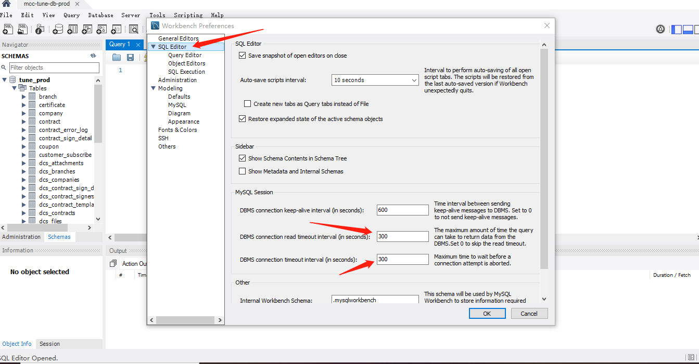
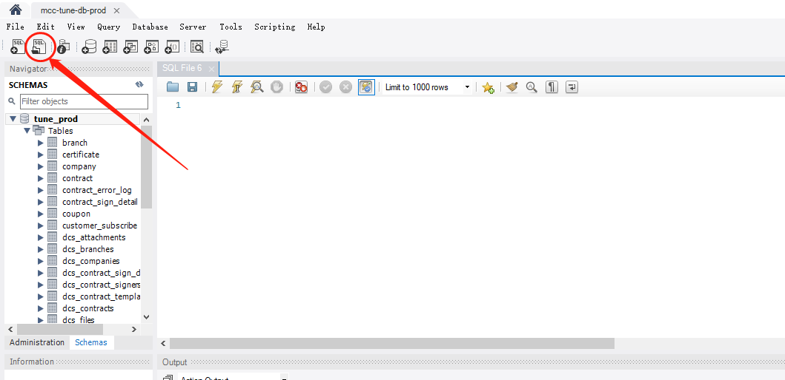
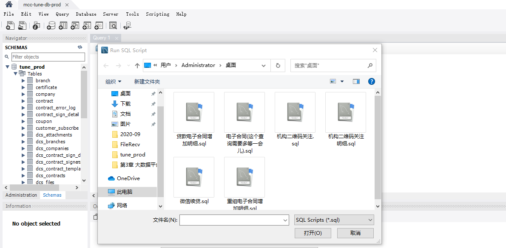
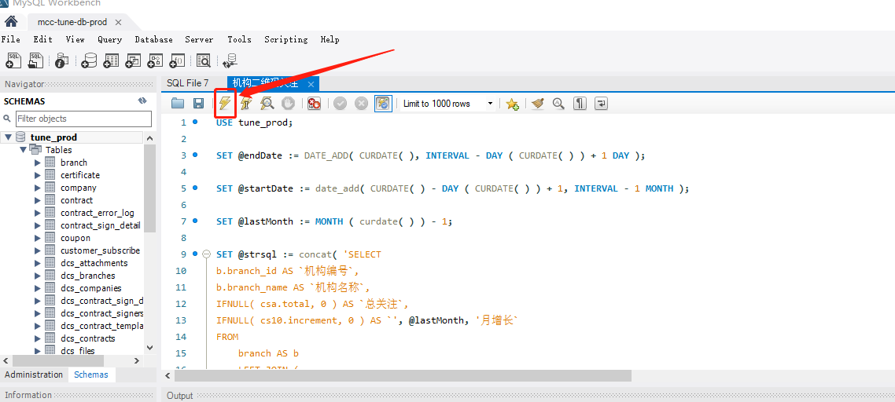
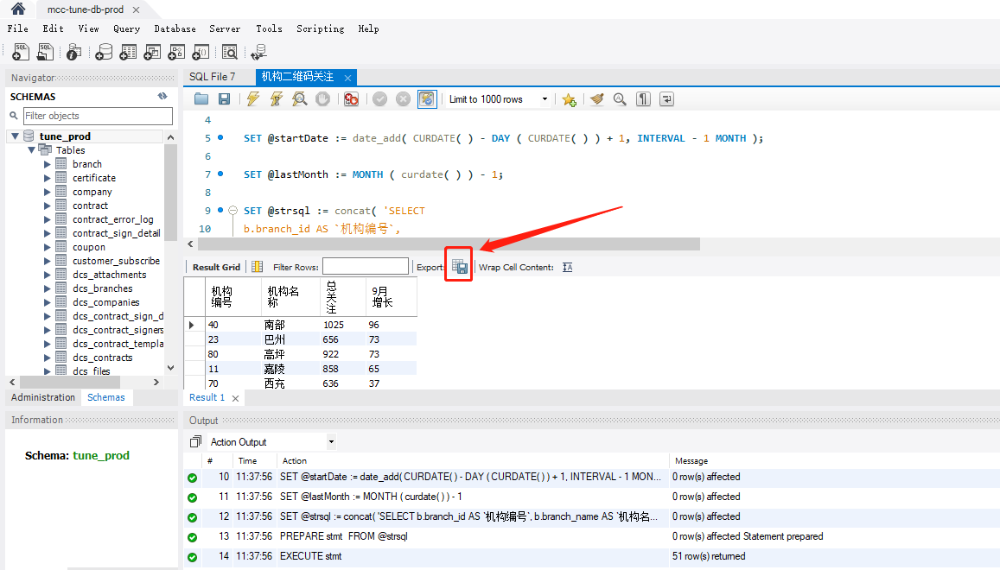
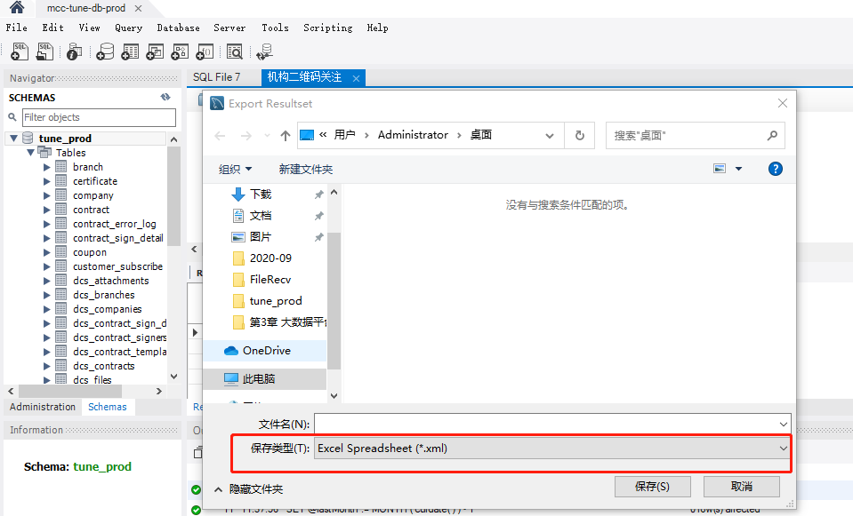

# Market Team Data

## 操作步骤
### 1. Workbench 设置
1. Edit -> Preferences -> SQL Editor
2. DBMS connection read timeout interval(in seconds) 设置为 300
3. DBMS connection timeout interval(in seconds) 设置为 300

## 2. 数据查询
1. 选择需要的SQL

2. 点击运行

## 3. 数据导出
1. 点击导出

2. 选择Excel Spreadsheet(*.xml) 或者 csv 导出

